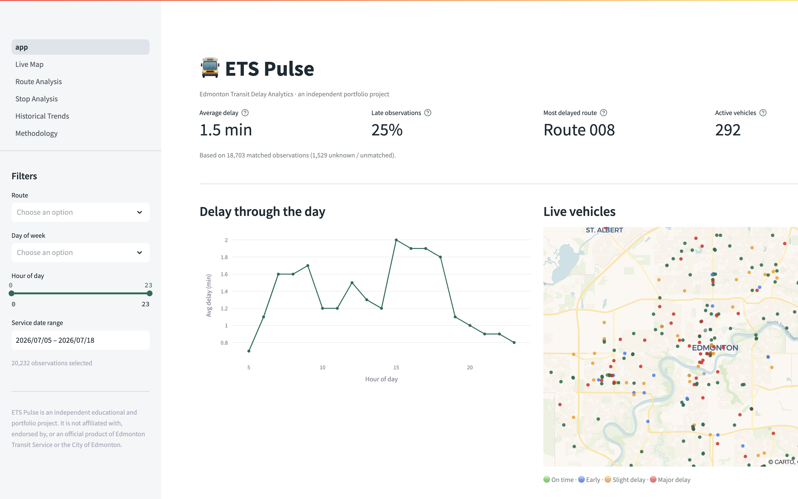
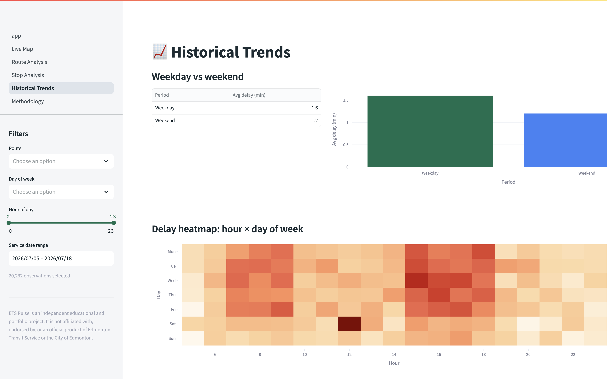
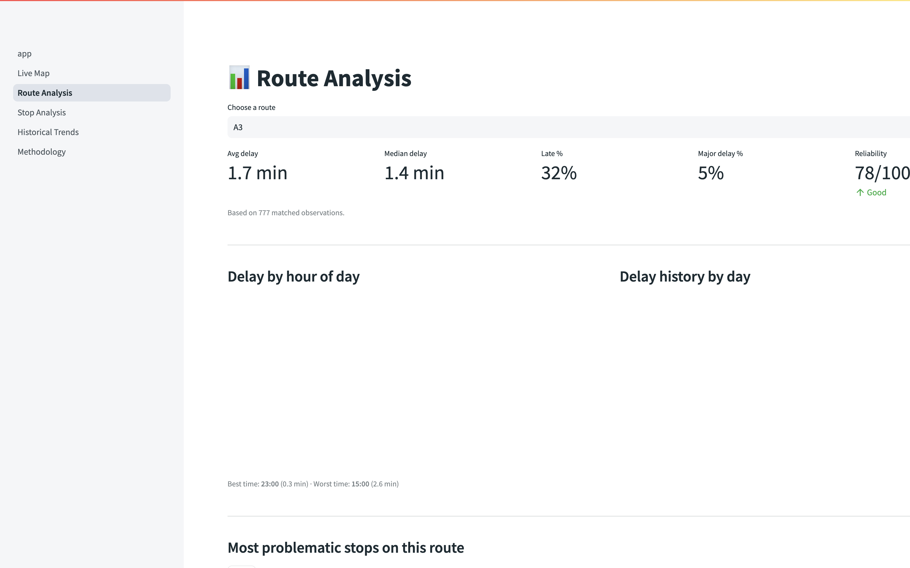

<div align="center">

# 🚍 ETS Pulse

### Edmonton Transit Delay Analytics

**A full data pipeline + interactive dashboard that turns live Edmonton Transit GTFS feeds into route-reliability, stop-level delay, and live-vehicle analytics.**


</div>

---



## What it does

ETS Pulse ingests **live GTFS-Realtime** and **static GTFS Schedule** data from Edmonton
Transit Service (ETS), matches every in-service vehicle to its scheduled stop, computes a
real delay, and stores clean observations so you can answer questions riders and planners
actually care about:

- ⏱️ **How reliable is transit right now?**
- 🚌 **Which routes and stops are delayed the most?**
- 🕐 **What times and days are most reliable?**
- 📈 **How are delay patterns changing over time?**

Because realtime feeds only describe *now*, ETS Pulse **builds its own history** by collecting
snapshots — turning an ephemeral live feed into an analyzable time series.

## Highlights

- 🗺️ **Live vehicle map** — real ETS buses plotted from the realtime feed, colored by delay status
- 📊 **Reliability analytics** — per-route average/median delay, late %, major-delay %, and a 0–100 reliability score
- 🔥 **Delay heatmaps** — hour × day-of-week patterns and geographic stop-level hotspots
- 🔎 **Drill-downs** — dedicated route and stop pages with best/worst travel times
- 🧮 **Honest methodology** — unmatched data stays *Unknown* (never faked to "on time"), with sample-size warnings everywhere
- ✅ **Tested** — 14 unit tests covering delay math, post-midnight GTFS times, thresholds, and protobuf parsing

<table>
<tr>
<td></td>
<td></td>
</tr>
<tr>
<td align="center"><em>Hour × day-of-week delay heatmap</em></td>
<td align="center"><em>Per-route reliability drill-down</em></td>
</tr>
</table>

## Architecture

```
        ETS GTFS Schedule (static)        ETS GTFS-Realtime (live .pb feeds)
                    │                                    │
                    ▼                                    ▼
        fetch_static_gtfs.py                     fetch_realtime.py
                    │                                    │
                    └───────────────┬────────────────────┘
                                    ▼
                 parse_realtime.py  +  match_schedule.py
              (decode protobuf, match prediction ↔ schedule)
                                    │
                                    ▼
                          calculate_delays.py
                (delay = predicted − scheduled, status thresholds)
                                    │
                                    ▼
                            SQLite  (database.py)
                                    │
                                    ▼
                 analytics.py  →  Streamlit app.py + pages/
             (aggregations, reliability score)   (cards, charts, maps)
```

## Tech stack

| Layer | Tools |
| --- | --- |
| Language | **Python 3.11+** |
| Data processing | **pandas** |
| Realtime feed parsing | **gtfs-realtime-bindings**, **protobuf** |
| Storage | **SQLite** (via `sqlite3` / SQLAlchemy) |
| Dashboard | **Streamlit** |
| Charts & maps | **Plotly**, **PyDeck** |
| Testing | **pytest** |
| Deployment | **Streamlit Community Cloud** (free) |

## Delay methodology

```
delay_seconds = predicted_arrival − scheduled_arrival
```

Edmonton's realtime feed publishes a predicted absolute arrival time (and often omits
`route_id`), so ETS Pulse **joins each realtime record to the static schedule**
(`stop_times.txt` + trip `start_date`) to recover the scheduled time and resolve the route —
including correct handling of GTFS times past `24:00:00`. Only **active, in-service trips**
(those with an assigned vehicle) are recorded — one observation per trip at its next stop —
which over repeated snapshots yields a clean delay history.

| Status | Rule |
| --- | --- |
| Early | delay &lt; −60 s |
| On time | −60 s to +120 s |
| Slight delay | +121 s to +300 s |
| Major delay | &gt; +300 s |
| Unknown | realtime record missing or unmatched |

> Missing realtime data is **never** treated as on time — it stays *Unknown* so route
> performance is not falsely improved.

## Is the data real?

**Yes.** ETS Pulse pulls directly from the official City of Edmonton feeds:

| Feed | Endpoint |
| --- | --- |
| GTFS Schedule (static) | `gtfs.edmonton.ca/TMGTFSRealTimeWebService/GTFS/gtfs.zip` |
| Trip Updates (realtime) | `gtfs.edmonton.ca/…/TripUpdate/TripUpdates.pb` |
| Vehicle Positions (realtime) | `gtfs.edmonton.ca/…/Vehicle/VehiclePositions.pb` |
| Alerts (realtime) | `gtfs.edmonton.ca/…/Alert/Alerts.pb` |

A single live collection matches ~**300 in-service vehicles** to **174 routes** and **6,570 stops**.

Because a realtime feed only exposes the present moment, the multi-day history shown by
default is a **realistic simulated backfill generated on top of the real route/stop network**,
so the dashboard is populated immediately. Running `scripts/collect_snapshot.py` on a
schedule accumulates genuine history that blends in seamlessly (same schema, same IDs, same
methodology). This is disclosed in the in-app **Methodology** page.

## Quickstart

```bash
git clone <your-repo-url> ets-pulse
cd ets-pulse

python3 -m venv .venv
source .venv/bin/activate            # Windows: .venv\Scripts\activate
pip install -r requirements.txt

python -m scripts.initialize_database        # create the SQLite schema
python -m scripts.generate_backfill --days 14  # seed a realistic history
python -m scripts.collect_snapshot           # (optional) pull a real live snapshot

./run.sh                                      # launch the dashboard
```

Open the URL Streamlit prints (default http://localhost:8501).

> **macOS note:** launch with `./run.sh` (or an activated virtualenv). It sets
> `ARROW_DEFAULT_MEMORY_POOL=system` to avoid a pyarrow/mimalloc segfault on macOS + Python 3.13.

### Build real history

```bash
# Collect a live snapshot every 5 minutes (cron)
*/5 * * * * cd /path/to/ets-pulse && ./.venv/bin/python -m scripts.collect_snapshot
```

## Tests

```bash
pip install -r requirements-dev.txt
python -m pytest
```

Covers delay calculation, GTFS times past midnight, status thresholds, missing values
staying *Unknown*, realtime protobuf parsing, and reliability-score bounds.

## Project structure

```
ets-pulse/
├── app.py                 # Overview dashboard (entry point)
├── run.sh                 # Crash-safe launcher
├── pages/                 # Live Map · Route · Stop · Historical · Methodology
├── src/
│   ├── config.py          # feed URLs, thresholds, status classification
│   ├── fetch_static_gtfs.py
│   ├── fetch_realtime.py
│   ├── parse_realtime.py  # protobuf → dicts
│   ├── match_schedule.py  # realtime ↔ schedule matching
│   ├── calculate_delays.py
│   ├── analytics.py       # aggregations + reliability score
│   ├── database.py        # SQLite layer
│   └── ui.py              # shared Streamlit helpers
├── scripts/               # initialize_database · collect_snapshot · generate_backfill
├── tests/                 # pytest suite
└── data/                  # SQLite db + cached static GTFS (gitignored)
```

## Engineering notes

- **Turns a live feed into a time series** — the core data-engineering idea: repeatedly
  snapshot an ephemeral realtime feed to build an analyzable history.
- **Correct schedule matching** — resolves missing route IDs and computes true delays by
  joining realtime predictions to `stop_times.txt`, handling post-midnight service times.
- **Signal over noise** — records only active, in-service trips (≈300/snapshot) instead of the
  feed's ~130k downstream stop predictions, avoiding massive over-counting.
- **Data honesty by design** — unmatched observations stay *Unknown*; every average is paired
  with an observation count; small samples are flagged.

## Roadmap

- 🌦️ Weather correlation and ML delay prediction (scikit-learn)
- 🧠 Natural-language insights (*"Why is Route 8 usually late on Mondays?"*)
- 🔔 Anomaly detection and best-time-to-travel recommendations
- ⚛️ Optional React + FastAPI front end

## Disclaimer

ETS Pulse is an independent educational and portfolio project. It is **not** affiliated with,
endorsed by, or an official product of Edmonton Transit Service or the City of Edmonton.

## License

Released under the MIT License.

---

